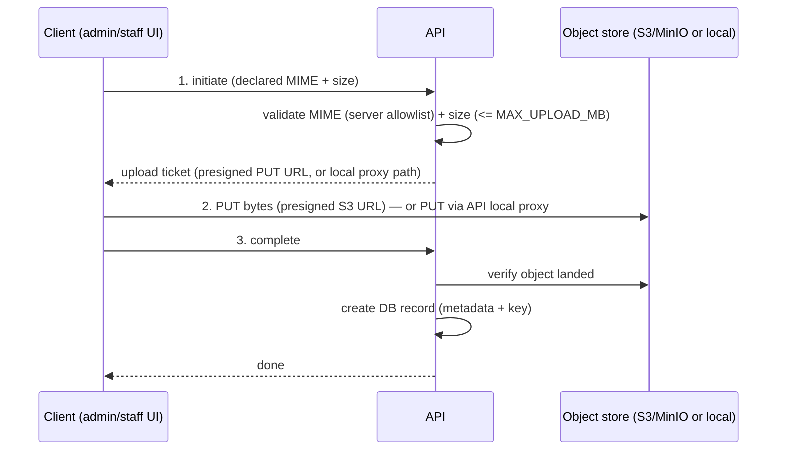

# Object Storage

How InfluenceOS stores attachment **blobs** (campaign and influencer files), how
uploads and downloads work, how the store is configured, and what durability the
store must provide in production. This is operational reference for anyone
running or recovering the platform.

> **Scope.** InfluenceOS is an internal, ADMIN/STAFF-only platform. There are no
> influencer-facing portals. All object access is mediated by the API — the
> browser never talks to the store with long-lived credentials.

## 1. Driver selection

`STORAGE_DRIVER` selects the storage backend:

| `STORAGE_DRIVER` | Backend | Use for |
|---|---|---|
| `local` | Files on local disk under `/uploads` | Development / single-host only |
| `s3` | S3-compatible object storage (AWS S3 or self-hosted MinIO) | Production, multi-host |

The `local` driver keeps blobs on the host filesystem. It is single-host by
construction: a second API/worker instance cannot see another host's `/uploads`,
so it is a development-only convenience. Any real deployment uses `s3`.

## 2. Private-by-default + presigned URLs

Buckets are **PRIVATE**. Objects are **never** public and there is no anonymous
read path. All access — upload and download — is granted through **presigned,
expiring URLs** (or, for the `local` driver, short-lived signed proxy paths).

- A client never holds the bucket credentials.
- A presigned URL grants a single operation (PUT or GET) on a single object and
  expires.
- The reverse proxy does not expose the store; it is reachable only on the
  private network (see §4).

## 3. Two-phase, signed upload flow

Uploads are two-phase and signed. The API authorizes the transfer, the bytes go
straight to the store (or through the local proxy), and the DB record is created
only after the object is confirmed to have landed.



**Step 1 — initiate.** The client declares the file's MIME type and size. The
API validates the MIME type against a **server-side allowlist** and checks the
declared size against the ceiling `MAX_UPLOAD_MB` (default **100**). On success
the API returns an **upload ticket**. Validation is server-side; a client cannot
bypass the allowlist or the size ceiling.

**Step 2 — transfer.** The client PUTs the bytes:

- `s3` driver: directly to a **presigned S3 PUT URL** (browser → store,
  cross-origin).
- `local` driver: through the **API's local-driver proxy** (the API writes the
  bytes to `/uploads`).

**Step 3 — complete.** The client calls `complete`. The API **verifies the
object actually landed** in the store, then creates the DB record holding the
attachment's metadata and object key. If the object is not present, no DB record
is created.

> **MinIO CORS.** MinIO's default CORS configuration permits the browser's
> cross-origin presigned PUT in step 2, so no extra CORS wiring is required for
> the standard flow.

## 4. Downloads

Downloads never expose the bucket. The path depends on the driver:

| Driver | Download mechanism |
|---|---|
| `s3` | A **presigned GET URL** to the object; expires. |
| `local` | A **short-lived signed proxy path** served by the API: `GET /files/:id/blob?token=...` |

In both cases the grant is scoped to a single object and time-limited.

## 5. Internal vs public endpoint

Presigned URLs embed a hostname. When the store sits behind a private network,
the hostname the **server** uses to reach the store is not the hostname the
**browser** can reach. InfluenceOS splits these:

| Env var | Used by | Purpose |
|---|---|---|
| `S3_INTERNAL_ENDPOINT` | The server (API/worker) | Reach the store on the **private network** |
| `S3_PUBLIC_ENDPOINT` | The browser | The **browser-facing** endpoint baked into presigned URLs |
| `S3_ENDPOINT` (legacy) | Both (fallback) | Fallback for both of the above when the split pair is unset |

The server signs the request against the store using `S3_INTERNAL_ENDPOINT`, but
the URL handed to the browser is rewritten to `S3_PUBLIC_ENDPOINT` so the browser
can actually reach it. They may be identical (store on the same reachable
network) or differ.

**Example — they differ.** MinIO runs on the private Docker network; the browser
reaches the store through a public TLS hostname:

```bash
# Server reaches MinIO on the private network:
S3_INTERNAL_ENDPOINT=http://minio:9000
# The browser cannot resolve "minio"; presigned URLs must use the public host:
S3_PUBLIC_ENDPOINT=https://files.example.com
```

**Example — they are the same** (managed AWS S3, publicly reachable both ways):

```bash
S3_INTERNAL_ENDPOINT=https://s3.eu-central-1.amazonaws.com
S3_PUBLIC_ENDPOINT=https://s3.eu-central-1.amazonaws.com
```

## 6. MIME allowlist and size ceiling

- **MIME allowlist** — enforced server-side at `initiate`. Only MIME types on
  the allowlist are accepted; the check cannot be skipped by the client.
- **Size ceiling** — the declared size must be `<= MAX_UPLOAD_MB` (default
  `100`). The declared size is checked at `initiate` before a ticket is issued.

## 7. Environment variables

| Variable | Applies to | Required | Notes |
|---|---|---|---|
| `STORAGE_DRIVER` | all | yes | `local` or `s3` |
| `MAX_UPLOAD_MB` | all | no | Upload size ceiling; default `100` |
| `S3_INTERNAL_ENDPOINT` | `s3` | yes* | Server-side endpoint on the private network |
| `S3_PUBLIC_ENDPOINT` | `s3` | yes* | Browser-facing endpoint baked into presigned URLs |
| `S3_ENDPOINT` | `s3` | fallback | Legacy single endpoint; fallback for both of the above |
| `S3_BUCKET` | `s3` | yes | Bucket name (private) |
| `S3_ACCESS_KEY_ID` | `s3` | yes | Access key |
| `S3_SECRET_ACCESS_KEY` | `s3` | yes | Secret key |
| `S3_REGION` | `s3` | no | Region |
| `S3_FORCE_PATH_STYLE` | `s3` | no | `true` for MinIO / path-style addressing |

\* The env contract requires **an endpoint** (`S3_INTERNAL_ENDPOINT`/
`S3_PUBLIC_ENDPOINT`, or the legacy `S3_ENDPOINT` fallback) plus a bucket, access
key, and secret. See §8.

### Fail-fast contract

The env contract in `apps/api/src/env.ts` **requires** endpoint + bucket + access
key + secret when `STORAGE_DRIVER=s3`. If any of these is missing, the API
**refuses to boot** — it does not start with a half-configured store.

```bash
# Minimum valid s3 configuration (MinIO / path-style):
STORAGE_DRIVER=s3
S3_INTERNAL_ENDPOINT=http://minio:9000
S3_PUBLIC_ENDPOINT=https://files.example.com
S3_BUCKET=influenceos
S3_ACCESS_KEY_ID=...
S3_SECRET_ACCESS_KEY=...
S3_FORCE_PATH_STYLE=true
```

## 8. Durability (production requirement)

**Object storage is the source of truth for attachment blobs.** The database
holds only their **metadata and object keys** — not the bytes.

> **Losing the bucket means losing the files.** If the bucket is lost, the DB
> rows remain but every download **404s**. The blobs are gone; the metadata
> pointing at them is not enough to reconstruct them.

Because the store is the system of record for blobs, it **must be durable**:

- **Managed S3** with built-in redundancy, **or**
- **Self-hosted MinIO** with **erasure coding / replication** **and its own
  backup**. MinIO redundancy protects against disk/node loss; it is not a
  substitute for a backup that protects against deletion, corruption, or
  operator error.
- **Recommended:** enable **bucket versioning**.
- **Ideally:** configure **cross-region / replication**.

> **The app-DB backup does NOT back up object storage.** This is called out
> explicitly: whatever backs up PostgreSQL does not touch the bucket. Object
> storage needs its own, separate durability and backup plan. A DB restore
> recovers metadata only — it cannot recover a lost blob.

## 9. Choosing a store: managed S3 vs self-hosted MinIO

| | Managed S3 (e.g. AWS S3) | Self-hosted MinIO |
|---|---|---|
| Redundancy | Built-in, provider-managed | You must configure erasure coding / replication |
| Backups | Still your responsibility (versioning + lifecycle/replication) | Entirely your responsibility — MinIO needs its **own** backup |
| Operational burden | Low — no store to run | Higher — you run, patch, and monitor MinIO |
| Network | Typically publicly reachable; internal/public endpoints often identical | Usually on the private network; internal ≠ public endpoint (see §5) |
| Path style | Virtual-hosted style | Path-style — set `S3_FORCE_PATH_STYLE=true` |
| Cost model | Per-GB + egress | Your hardware |

Both are valid. Whichever you pick, the durability requirements in §8 apply:
redundancy **and** a separate backup, and remember the DB backup does not cover
blobs.

## 10. How it's verified

Object storage is exercised by CI, not just asserted:

- **MinIO round-trip (integration test).** CI runs a real MinIO round-trip
  against the `s3` driver.
- **`e2e-s3` CI job.** The full browser journey — **upload → download → delete**
  — is tested end-to-end against S3/MinIO, including the presigned PUT and GET
  paths and the cross-origin CORS behaviour.

These jobs are the guard against regressions in the two-phase upload, the
presigned-URL model, and the internal/public endpoint split.
