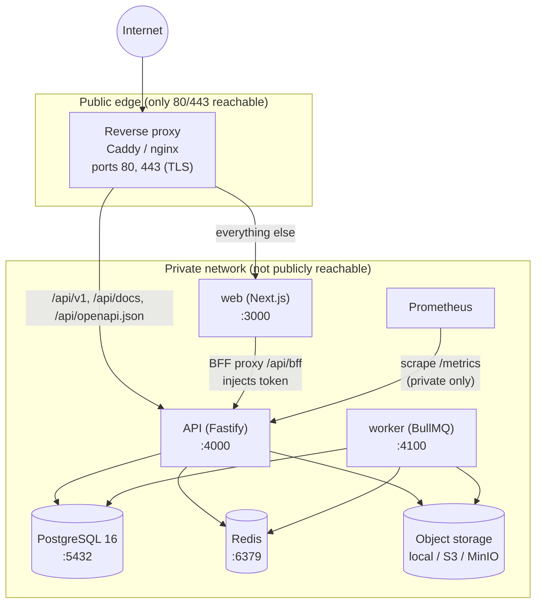

# Production Architecture

InfluenceOS is an internal influencer-campaign management platform. This document
describes the production architecture, the services that compose it, and how
requests and data move through the system.

## Overview

InfluenceOS is **API-first**. All business logic lives in the
`@influenceos/domain` package. Every other component is a client of that logic:

- The API (`apps/api`) exposes the domain over HTTP under `/api/v1`.
- The web app (`apps/web`) is a **pure client** of the API. It contains no
  business logic of its own.
- The worker (`apps/worker`) runs background jobs that call into the same domain.

### Hard constraints

These are structural rules for the system, not preferences:

- **Internal, ADMIN/STAFF only.** InfluenceOS is an internal company platform.
  There are **no influencer-facing portals** and no public sign-up.
- **No AI features.** The platform contains no AI/LLM functionality.
- **Business logic only in `@influenceos/domain`.** The web app never implements
  business rules; it calls the API. The API and worker are thin transports over
  the domain package.
- **API-first.** All business behavior is reachable through the versioned API
  (`/api/v1`), which makes the platform consumable by clients other than the web
  app (see the mobile note below).

### Monorepo layout

The repository is a pnpm workspaces + Turborepo monorepo.

- Packages: `@influenceos/contracts`, `@influenceos/domain`,
  `@influenceos/database`, `@influenceos/shared`, `@influenceos/api-client`.
- Apps: `apps/api`, `apps/web`, `apps/worker`.

## Topology

The trust boundary is the reverse proxy: only ports **80** and **443** are
public. The web app, API, worker, database, Redis, object storage, and the
`/metrics` endpoint are all reachable only on the private network.

## Components

| Service | Port | Responsibility | Depends on |
|---|---|---|---|
| Reverse proxy (`deploy/caddy/Caddyfile` or `deploy/nginx/influenceos.conf`) | 80, 443 | TLS termination, routing (`/api/v1`, `/api/docs`, `/api/openapi.json` → API; everything else → web), security headers, request-body ceiling | web, API |
| web (`apps/web`, Next.js 15 / React 19) | 3000 | Server-rendered admin/staff UI; BFF token transport; same-origin API proxy at `/api/bff` | API |
| API (`apps/api`, Fastify 5) | 4000 (`API_PORT`), host `0.0.0.0` (`API_HOST`) | All HTTP business logic under `/api/v1`; auth; health/readiness/metrics | PostgreSQL, Redis (optional rate-limit store), object storage, `@influenceos/domain` |
| worker (`apps/worker`, BullMQ + ioredis) | 4100 (`WORKER_PORT`) | Background queues: `content-check`, `follower-sync`, `maintenance`; maintenance sweep cron | Redis, PostgreSQL, object storage |
| PostgreSQL 16 (Prisma 6) | 5432 | System of record (cuid IDs) | — |
| Redis | 6379 | Backs BullMQ queues; optional rate-limit store | — |
| Object storage | local / S3 / MinIO (9000/9001) | Media storage; private buckets, presigned uploads | — |
| Prometheus | (private) | Scrapes API `/metrics` | API |

## Request and data flow

### Browser request (web app)

The browser holds **no tokens**. Token transport uses a Backend-for-Frontend
(BFF) pattern:

1. The browser calls the web app. Session state is carried in httpOnly cookies
   `io_at` (access, 15 min) and `io_rt` (refresh, 7 day). Cookies are
   `httpOnly` + `sameSite=lax` + `secure` (in production).
2. When the UI needs data, it calls the same-origin proxy at `/api/bff`.
3. The BFF proxy reads the cookie and **injects the access token** as it forwards
   the call to the API at `/api/v1`.
4. The API validates the token, runs domain logic, and reads/writes PostgreSQL
   (and object storage as needed).
5. The response returns through the BFF proxy to the browser. The token never
   reaches browser JavaScript.

### API client (bearer token)

A non-browser client (for example a future mobile app or an internal integration)
calls the API directly:

1. The client authenticates and holds a bearer access token itself.
2. The client sends `Authorization: Bearer <token>` directly to `/api/v1`.
3. The API validates the token, runs domain logic, and reads/writes PostgreSQL
   and object storage.

There is no BFF and no cookie in this path; the client is responsible for token
storage and refresh.

> **Mobile note (designed-for, not built).** The API-first design anticipates a
> future mobile app that calls the API directly with tokens stored in the OS
> keychain. This is a design property of the current API, not shipped
> functionality — there is no mobile client today.

## Network and ports

| Service / port | Public? | Notes |
|---|---|---|
| Reverse proxy 80 / 443 | **Public** | The only publicly reachable ports; TLS on 443 |
| web 3000 | Private | Reached only via the proxy |
| API 4000 | Private | Reached only via the proxy (`/api/v1`, `/api/docs`, `/api/openapi.json`) |
| API `/metrics` | Private | **Internal only** — never exposed by the public reverse proxy |
| worker 4100 | Private | Health endpoint on the private network |
| PostgreSQL 5432 | Private | Must not be publicly reachable |
| Redis 6379 | Private | Must not be publicly reachable |
| MinIO 9000 / 9001 | Private | Must not be publicly reachable |

The reverse proxy routes `/api/v1`, `/api/docs`, and `/api/openapi.json` to the
API and everything else to the web app. The API, worker, PostgreSQL, Redis,
MinIO, and `/metrics` must **not** be publicly reachable.

## Release identity

`APP_VERSION`, `GIT_SHA`, and `BUILD_TIME` are injected at deploy time. They are
surfaced on the API `/health` endpoint, in `/metrics` (as
`influenceos_build_info`), and on the web **Settings → Platform** page (git SHA /
built / uptime tiles). These values are release identifiers and are never
secrets.

## Environments

| Environment | Purpose | Key differences |
|---|---|---|
| Development | Local development | Uses `.env.example` as the template; the dev stack is `docker-compose.yml`; object storage defaults to `local`; seeding is available for demo data (guarded). |
| Staging | Pre-production verification | Production-like configuration and the production compose semantics; used to validate a release before promoting it. |
| Production | Live internal platform | Uses `.env.production.example` as the template and `docker-compose.full.yml`; every secret is required; migrations applied with `pnpm db:deploy`; seeding never runs; `secure` cookies and HSTS are on; `/metrics` is internal only. |

Configuration for all environments is validated at startup by
`apps/api/src/env.ts`, which exits `1` with a printed report if the environment
is invalid (fail-fast). The two templates are `.env.example` (development) and
`.env.production.example` (production).
